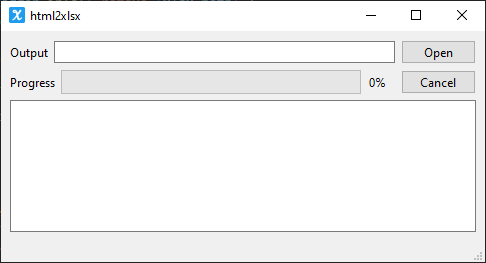

# html2xlsx

Convert HTML Table to Excel xlsx via Python.



## Pack
```
pyinstaller html2xlsx.spec -y
```

## TLDR

- html table解析：
  - pandas，其后端使用lxml等解析，然后将其存为DataFrame。
  - lxml，应该是最快的xml解析库，且可使用`etree.iterparse`流式解析，不足是文本中有`&`将解析失败。
  - HTMLParser(stdlib)，方便自定义文本处理，速度一般。
- 保存：xlsxwriter

## 示例数据
demo.html:

```html
<html>
    <head>
        <title>Demo</title>
        <meta charset="utf-8">
    </head>
    <body>
        <table>
            <tr>
                <th>id</th>
                <th>name</th>
            </tr>
            <tr>
                <td>1</td>
                <td>John</td>
            </tr>
        </table>
    </body>
</html>
```

## pandas解析

```python
import pandas as pd

url = 'demo.html'
with open(url, encoding='utf-8') as f:
    tables = pd.read_html(f.read())
```

## lxml解析

使用`xpath`解析(**DOM**)，整个文档加载：

```python
from lxml import html

url = 'demo.html'
with open(url, encoding='utf-8') as f:
    for tbl in root.xpath('//table'):
    	elements = tbl.xpath('.//tr/td//text()')
    	print elements
```

使用`etree.iterparse`解析(**SAX**, Simple API for XML)，流式加载逐步解析，原文件`.html`很大时可以节省内存：

```python
for event, element in etree.iterparse(url, tag='TR', events=('start', 'end')):
    for child in element:
        print(child.tag, child.text)
    element.clear()
```

**DOM**与**SAX**解析的区别：

**SAX** (**Simple API for XML**) is an [event-driven](https://en.wikipedia.org/wiki/Event-driven_programming) [online algorithm](https://en.wikipedia.org/wiki/Online_algorithm) for [parsing](https://en.wikipedia.org/wiki/Parsing) [XML](https://en.wikipedia.org/wiki/XML) documents, with an [API](https://en.wikipedia.org/wiki/Application_programming_interface) developed by the XML-DEV mailing list.[[1\]](https://en.wikipedia.org/wiki/Simple_API_for_XML#cite_note-event-based-1) SAX provides a mechanism for reading data from an XML document that is an alternative to that provided by the [Document Object Model](https://en.wikipedia.org/wiki/Document_Object_Model) (DOM). Where the DOM operates on the document as a whole—building the full [abstract syntax tree](https://en.wikipedia.org/wiki/Abstract_syntax_tree) of an XML document for convenience of the user—SAX parsers operate on each piece of the XML document sequentially, issuing parsing events while making a single pass through the input stream.

`lxml.etree.XMLSyntaxError: htmlParseEntityRef: expecting ';'`问题：

比如`<td>abc&ef<>`，文本中有`&`字符，解决

> The problem is that the HTML is malformed. To solve this, you can use [BeautifulSoup](http://www.crummy.com/software/BeautifulSoup/) (it's able to parse this HTML) or sanitize the HTML before trying to parse it.

[lxml.etree.XMLSyntaxError: htmlParseEntityRef: expecting ';'](https://stackoverflow.com/questions/8664488/lxml-etree-xmlsyntaxerror-htmlparseentityref-expecting)

## HTMLParser解析

Subclass HTMLParser，实现自定义处理：

```python
from html.parser import HTMLParser

# 逻辑实现
class MyHTMLParser(HTMLParser):
    def __init__(self, callback):
        self.finished = False
        self.in_table = False
        self.in_row = False
        self.in_cell = False
        self.current_row = []
        self.current_cell = None
        self.row_idx = 0
        self.callback = callback
        HTMLParser.__init__(self)

    def handle_starttag(self, tag, attrs):
        attrs = dict(attrs)
        if not self.in_table:
            if tag == 'table':
                self.in_table = True
        else:
            if tag == 'tr':
                self.in_row = True
            elif tag == 'td' or tag == 'th':
                self.in_cell = True

    def handle_endtag(self, tag):
        if tag == 'tr':
            if self.in_table:
                if self.in_row:
                    self.in_row = False
                    self.callback(self.row_idx, self.current_row)
                    self.current_row = []
                    self.row_idx += 1
        elif tag == 'td' or tag == 'th':
            if self.in_table:
                if self.in_cell:
                    self.in_cell = False
                    self.current_row.append(self.current_cell)
                    self.current_cell = None
        elif (tag == 'table') and self.in_table:
            self.finished = True

    def handle_data(self, data):
        if self.in_cell:
            self.current_cell = data.strip() if data else data

# 解析
parser = MyHTMLParser(write_row)
url = 'demo.html'
with open(url, encoding='utf-8') as f:
    parser.feed(f.read())
```

## xlsxwriter保存

配置`{'constant_memory': True}`，其将直接落盘而不是全部缓存于内存，避免大文件内存爆炸，但就无法使用数据后处理的高级功能。

```python
import xlsxwriter

workbook = xlsxwriter.Workbook('demo.xlsx', {'constant_memory': True})
worksheet = workbook.add_worksheet()
worksheet.write(row, col, data)
workbook.close()
```